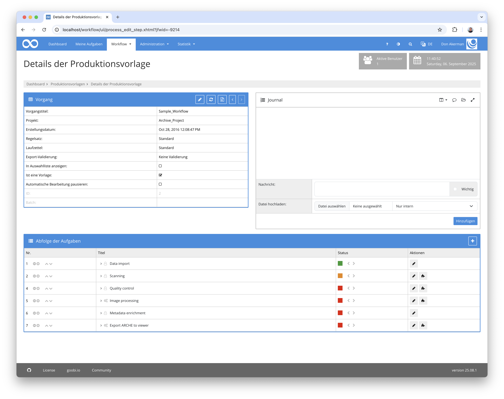
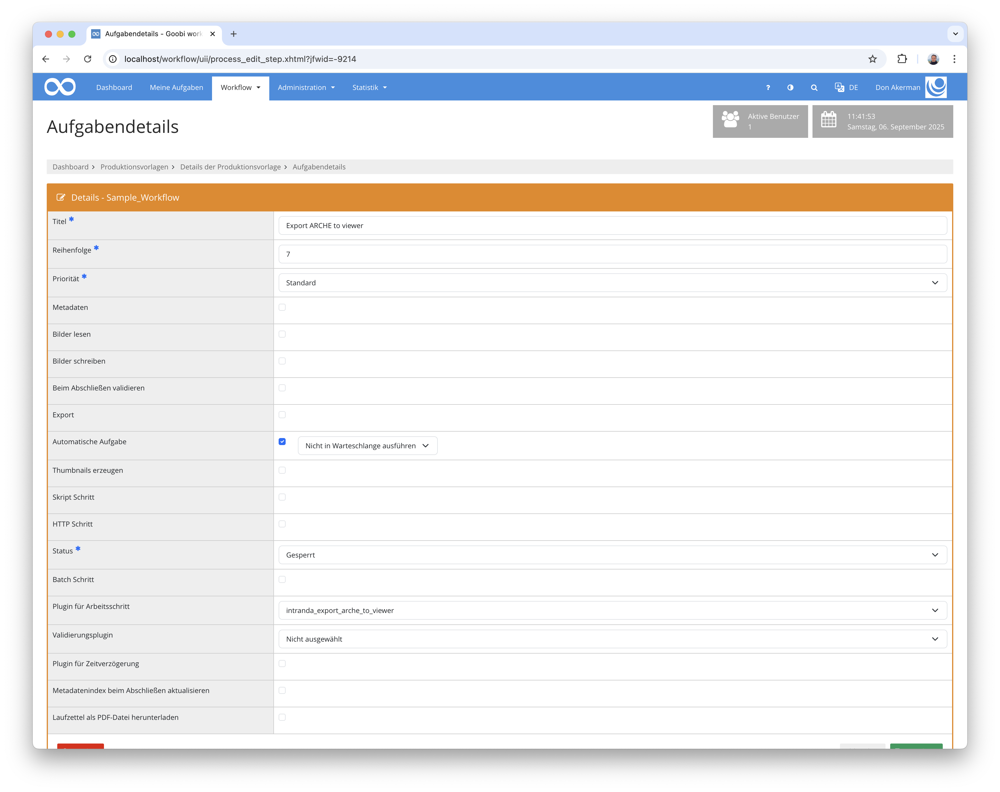

## Einführung
Diese Dokumentation erläutert das Plugin für zum Export der ARCHE Daten in den Goobi viewer.


## Installation
Um das Plugin nutzen zu können, muss folgende Datei installiert werden:

```bash
/opt/digiverso/goobi/plugins/export/plugin-export-arche-to-viewer-base.jar
```

Zusätzlich muss das Plugin `intranda_administration_arche_project_export` installiert und konfiguriert worden sein.

Nach der Installation des Plugins kann dieses innerhalb des Workflows für die jeweiligen Arbeitsschritte ausgewählt und somit automatisch ausgeführt werden. Ein Workflow könnte dabei beispielhaft wie folgt aussehen:



Für die Verwendung des Plugins muss dieses in einem Arbeitsschritt ausgewählt sein:




## Überblick und Funktionsweise
Vorraussetzung für den Export ist der Ingest des Vorgangs in ARCHE.

Startet man den Export, wird zuerst nach der TopCollection des Projekts und der Collection-Resource für den Vorgang in ARCHE gesucht. Beide Datensätze müssen existieren, sonst kann der Vorgang nicht exportiert werden.

Anschließend werden die `folder` und `file` Resourcen mit den Daten aus dem Dateisystem verglichen. Wenn alle Bilder und ALTO-Dateien auch in ARCHE existieren, wird mit dem Export fortgefahren. 

Dabei wird eine `METS/MODS`-Datei erzeugt, die sich in einigen Punkten vom Standard-Export unterscheidet. Zum einen werden keine Bilder oder OCR-Daten exportiert und zum anderen unterschieden sich die `fileGroups`. 

Bei allen Aufrufen ist gegebenfalls eine Authentifizierung notwendig, falls die ARCHE API entsprechend konfiguriert wurde.

### ALTO

Bei Dateigruppen mit dem Namen `ALTO` oder `FULLTEXT` wird auf die XML-Datei in ARCHE verwiesen:

```xml
<mets:fileGrp USE="FULLTEXT">
  <mets:file ID="FILE_0001_FULLTEXT" MIMETYPE="application/xml">
    <mets:FLocat LOCTYPE="URL" xlink:href="https://id.acdh.oeaw.ac.at/Archive_Project/bergsphi_625017145/bergsphi_625017145_ocr/00000001.xml" xlink:type="simple" />
  </mets:file>
  <mets:file ID="FILE_0002_FULLTEXT" MIMETYPE="application/xml">
    <mets:FLocat LOCTYPE="URL" xlink:href="https://id.acdh.oeaw.ac.at/Archive_Project/bergsphi_625017145/bergsphi_625017145_ocr/00000002.xml" xlink:type="simple" />
  </mets:file>
</mets:fileGrp>
```

Diese URL leitet direkt auf das entsprechende Binary in ARCHE weiter:

http://127.0.0.1/api/10172

Sollten weiter Informationen wie Dateigröße, MimeType, Dateiname benötigt werden, können sie durch einen Aufruf der `/metadata` Resource erlangt werden:

http://127.0.0.1/api/10172/metadata


```
@prefix n0: <http://127.0.0.1/api/>.

@prefix n1: <https://vocabs.acdh.oeaw.ac.at/schema#>.

@prefix n2: <http://www.w3.org/1999/02/22-rdf-syntax-ns#>.

@prefix n3: <https://id.acdh.oeaw.ac.at/Archive_Project/bergsphi_625017145/bergsphi_625017145_ocr/>.

<http://127.0.0.1/api/10172> n1:aclWrite "admin";
    n1:hasCategory <http://127.0.0.1/api/527>;
    n1:hasOwner <http://127.0.0.1/api/10051>;
    n1:isPartOf <http://127.0.0.1/api/10171>;
    n1:hasUpdatedRole "admin";
    n1:hasBinaryUpdatedDate "2025-05-19T10:59:29.565703"^^<http://www.w3.org/2001/XMLSchema#dateTime>;
    n1:hasBinaryUpdatedRole "admin";
    n1:aclRead "admin";
    n1:hasRightsHolder <http://127.0.0.1/api/10051>;
    n1:hasCurator <http://127.0.0.1/api/10050>;
    n1:hasHash "sha1:1656d83eb38353d8da2b56ff4aa0bfca662e7c78";
    n1:hasRawBinarySize "224231"^^<http://www.w3.org/2001/XMLSchema#positiveInteger>;
    a n1:Resources;
    n1:hasLicense <http://127.0.0.1/api/8443>;
    n1:hasDepositor <http://127.0.0.1/api/10050>;
    n1:hasMetadataCreator <http://127.0.0.1/api/10050>;
    n1:createdBy "admin";
    n1:hasIdentifier <https://id.acdh.oeaw.ac.at/Archive_Project/bergsphi_625017145/bergsphi_625017145_ocr/bergsphi_625017145_00000001.xml>, <http://127.0.0.1/api/10172>;
    n1:hasAvailableDate "2025-05-19T10:59:29.416889"^^<http://www.w3.org/2001/XMLSchema#dateTime>;
    n1:hasFormat "application/xml";
    n1:hasLicensor <http://127.0.0.1/api/10051>;
    n1:hasUpdatedDate "2025-05-19T10:59:29.570071"^^<http://www.w3.org/2001/XMLSchema#dateTime>;
    n1:hasTitle "bergsphi_625017145_ocr_00000001.xml"@en;
    n1:hasBinarySize "224231"^^<http://www.w3.org/2001/XMLSchema#nonNegativeInteger>.
```

### Thumbnails

Die Thumbnails werden wie folgt aufgeführt:

```xml
<mets:fileGrp USE="THUMBS">
  <mets:file ID="FILE_0001_THUMBS" MIMETYPE="image/png">
    <mets:FLocat LOCTYPE="URL" xlink:href="https://id.acdh.oeaw.ac.at/Archive_Project/bergsphi_625017145/bergsphi_625017145_media/00000001.jpg?format=thumbnail" xlink:type="simple" />
  </mets:file>
  <mets:file ID="FILE_0002_THUMBS" MIMETYPE="image/png">
    <mets:FLocat LOCTYPE="URL" xlink:href="https://id.acdh.oeaw.ac.at/Archive_Project/bergsphi_625017145/bergsphi_625017145_media/00000002.jpg?format=thumbnail" xlink:type="simple" />
  </mets:file>
</mets:fileGrp>
```

URLs von Dateigruppen mit der Bezeichnung `THUMBS`, `THUMBNAIL` oder `THUMBNAILS` leiten auf den ARCHE-Imageserver weiter, der die Daten immer als PNG ausliefert:

https://arche-thumbnails.acdh.oeaw.ac.at/?id=http%3A%2F%2F127.0.0.1%2Fapi%2F10115&width=100&height=100


### Bilder

Die Bilder werden in der METS-Datei so ausgewiesen:

```xml
<mets:fileGrp USE="PRESENTATION">
  <mets:file ID="FILE_0001_PRESENTATION" MIMETYPE="image/jpeg">
    <mets:FLocat LOCTYPE="URL" xlink:href="https://id.acdh.oeaw.ac.at/Archive_Project/bergsphi_625017145/bergsphi_625017145_media/00000001.jpg?format=image%2Fjpeg" xlink:type="simple" />
  </mets:file>
  <mets:file ID="FILE_0002_PRESENTATION" MIMETYPE="image/jpeg">
    <mets:FLocat LOCTYPE="URL" xlink:href="https://id.acdh.oeaw.ac.at/Archive_Project/bergsphi_625017145/bergsphi_625017145_media/00000002.jpg?format=image%2Fjpeg" xlink:type="simple" />
  </mets:file>
</mets:fileGrp>
```
    
Die Dateigruppen `PRESENTATION` oder `DEFAULT` enthalten URLs, die auf den ARCHE IIIF Image Server weiterleiten:

https://loris.acdh.oeaw.ac.at/10115/full/full/0/default.jpeg


