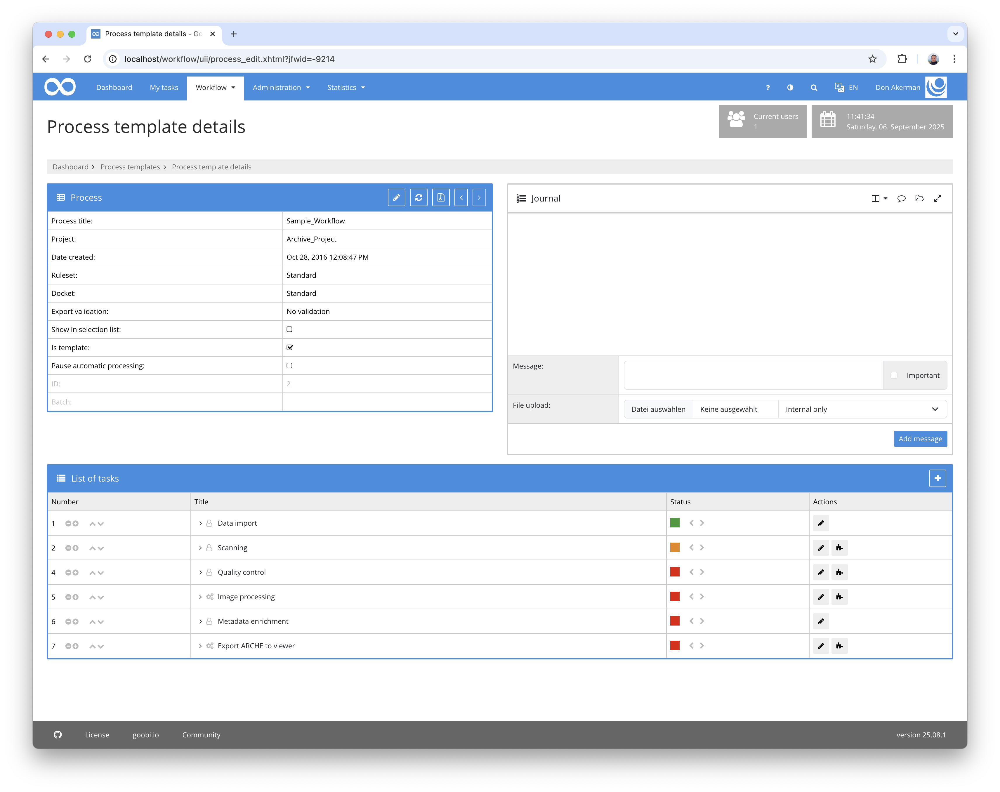
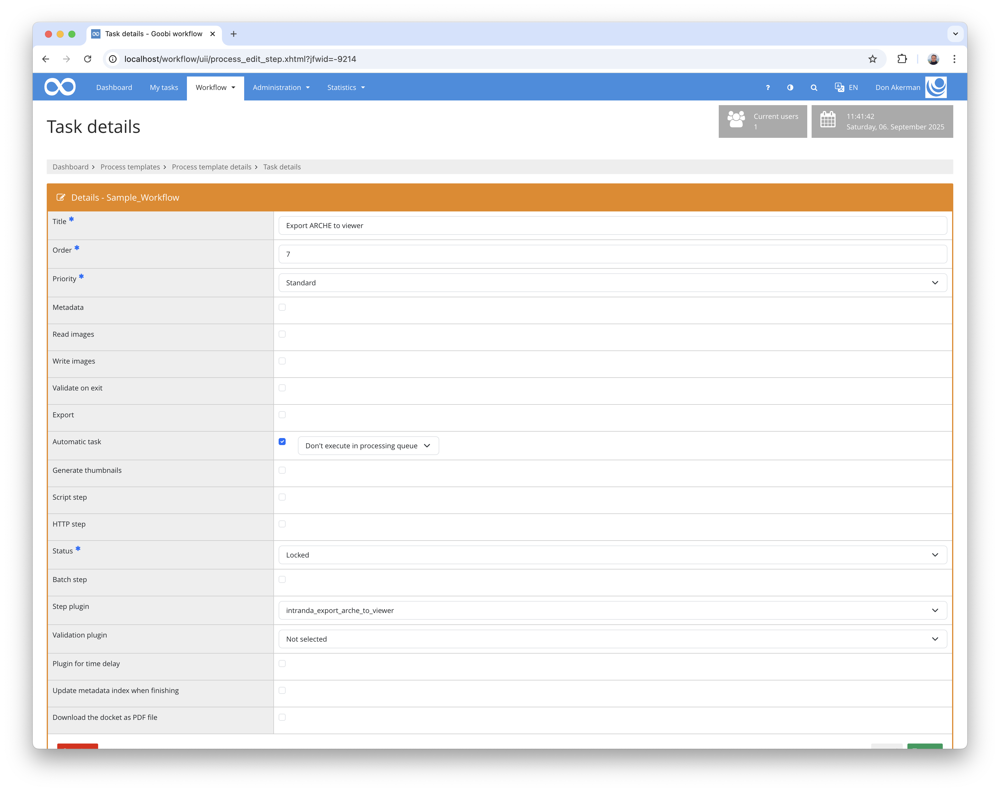

## Introduction
This documentation explains the plugin for exporting ARCHE data to the Goobi viewer.


## Installation
To use the plugin, the following file must be installed:

```bash
/opt/digiverso/goobi/plugins/export/plugin-export-arche-to-viewer-base.jar
```

In addition, the plugin `intranda_administration_arche_project_export` must be installed and configured.

After installing the plugin, it can be selected within the workflow for the respective work steps and thus executed automatically. An example workflow could look like this:



To use the plugin, it must be selected in a workflow step:




## Overview and functionality
The prerequisite for exporting is that the process has been ingested into ARCHE.

When you start the export, the system first searches for the project's TopCollection and the collection resource for the process in ARCHE. Both data sets must exist, otherwise the process cannot be exported.

The `folder` and `file` resources are then compared with the data from the file system. If all images and ALTO files also exist in ARCHE, the export proceeds. 

A `METS/MODS` file is generated, which differs from the standard export in a number of ways. Firstly, no images or OCR data are exported and secondly, the `fileGroups` differ. 

Authentication may be required for all calls if the ARCHE API has been configured accordingly.

### ALTO

For file groups named `ALTO` or `FULLTEXT`, reference is made to the XML file in ARCHE:

```xml
<mets:fileGrp USE="FULLTEXT">
  <mets:file ID="FILE_0001_FULLTEXT" MIMETYPE="application/xml">
    <mets:FLocat LOCTYPE="URL" xlink:href="https://id.acdh.oeaw.ac.at/Archive_Project/bergsphi_625017145/bergsphi_625017145_ocr/00000001.xml" xlink:type="simple" />
  </mets:file>
  <mets:file ID="FILE_0002_FULLTEXT" MIMETYPE="application/xml">
    <mets:FLocat LOCTYPE="URL" xlink:href="https://id.acdh.oeaw.ac.at/Archive_Project/bergsphi_625017145/bergsphi_625017145_ocr/00000002.xml" xlink:type="simple" />
  </mets:file>
</mets:fileGrp>
```

This URL redirects directly to the corresponding binary in ARCHE:

http://127.0.0.1/api/10172

If further information such as file size, MimeType, or file name is required, it can be obtained by calling the `/metadata` resource:
http://127.0.0.1/api/10172/metadata


```
@prefix n0: <http://127.0.0.1/api/>.

@prefix n1: <https://vocabs.acdh.oeaw.ac.at/schema#>.

@prefix n2: <http://www.w3.org/1999/02/22-rdf-syntax-ns#>.

@prefix n3: <https://id.acdh.oeaw.ac.at/Archive_Project/bergsphi_625017145/bergsphi_625017145_ocr/>.

<http://127.0.0.1/api/10172> n1:aclWrite "admin";
    n1:hasCategory <http://127.0.0.1/api/527>;
    n1:hasOwner <http://127.0.0.1/api/10051>;
    n1:isPartOf <http://127.0.0.1/api/10171>;
    n1:hasUpdatedRole "admin";
    n1:hasBinaryUpdatedDate "2025-05-19T10:59:29.565703"^^<http://www.w3.org/2001/XMLSchema#dateTime>;
    n1:hasBinaryUpdatedRole "admin";
    n1:aclRead "admin";
    n1:hasRightsHolder <http://127.0.0.1/api/10051>;
    n1:hasCurator <http://127.0.0.1/api/10050>;
    n1:hasHash "sha1:1656d83eb38353d8da2b56ff4aa0bfca662e7c78";
    n1:hasRawBinarySize "224231"^^<http://www.w3.org/2001/XMLSchema#positiveInteger>;
    a n1:Resources;
    n1:hasLicense <http://127.0.0.1/api/8443>;
    n1:hasDepositor <http://127.0.0.1/api/10050>;
    n1:hasMetadataCreator <http://127.0.0.1/api/10050>;
    n1:createdBy "admin";
    n1:hasIdentifier <https://id.acdh.oeaw.ac.at/Archive_Project/bergsphi_625017145/bergsphi_625017145_ocr/bergsphi_625017145_00000001.xml>, <http://127.0.0.1/api/10172>;
    n1:hasAvailableDate "2025-05-19T10:59:29.416889"^^<http://www.w3.org/2001/XMLSchema#dateTime>;
    n1:hasFormat "application/xml";
    n1:hasLicensor <http://127.0.0.1/api/10051>;
    n1:hasUpdatedDate "2025-05-19T10:59:29.570071"^^<http://www.w3.org/2001/XMLSchema#dateTime>;
    n1:hasTitle "bergsphi_625017145_ocr_00000001.xml"@en;
    n1:hasBinarySize "224231"^^<http://www.w3.org/2001/XMLSchema#nonNegativeInteger>.
```

### Thumbnails

The thumbnails are listed as follows:

```xml
<mets:fileGrp USE="THUMBS">
  <mets:file ID="FILE_0001_THUMBS" MIMETYPE="image/png">
    <mets:FLocat LOCTYPE="URL" xlink:href="https://id.acdh.oeaw.ac.at/Archive_Project/bergsphi_625017145/bergsphi_625017145_media/00000001.jpg?format=thumbnail" xlink:type="simple" />
  </mets:file>
  <mets:file ID="FILE_0002_THUMBS" MIMETYPE="image/png">
    <mets:FLocat LOCTYPE="URL" xlink:href="https://id.acdh.oeaw.ac.at/Archive_Project/bergsphi_625017145/bergsphi_625017145_media/00000002.jpg?format=thumbnail" xlink:type="simple" />
  </mets:file>
</mets:fileGrp>
```

URLs of file groups with the designation `THUMBS`, `THUMBNAIL` or `THUMBNAILS` redirect to the ARCHE image server, which always delivers the data as PNG:

https://arche-thumbnails.acdh.oeaw.ac.at/?id=http%3A%2F%2F127.0.0.1%2Fapi%2F10115&width=100&height=100


### Images

The images are identified in the METS file as follows:

```xml
<mets:fileGrp USE="PRESENTATION">
  <mets:file ID="FILE_0001_PRESENTATION" MIMETYPE="image/jpeg">
    <mets:FLocat LOCTYPE="URL" xlink:href="https://id.acdh.oeaw.ac.at/Archive_Project/bergsphi_625017145/bergsphi_625017145_media/00000001.jpg?format=image%2Fjpeg" xlink:type="simple" />
  </mets:file>
  <mets:file ID="FILE_0002_PRESENTATION" MIMETYPE="image/jpeg">
    <mets:FLocat LOCTYPE="URL" xlink:href="https://id.acdh.oeaw.ac.at/Archive_Project/bergsphi_625017145/bergsphi_625017145_media/00000002.jpg?format=image%2Fjpeg" xlink:type="simple" />
  </mets:file>
</mets:fileGrp>
```
    
The file groups `PRESENTATION` or `DEFAULT` contain URLs that redirect to the ARCHE IIIF Image Server:

https://loris.acdh.oeaw.ac.at/10115/full/full/0/default.jpeg


